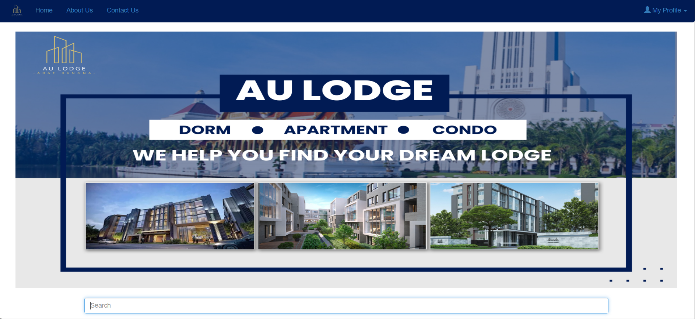
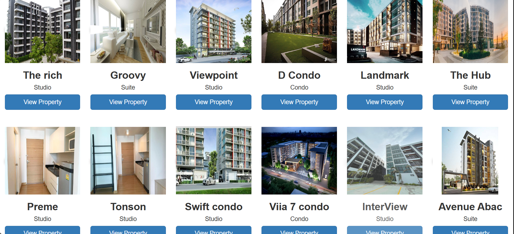
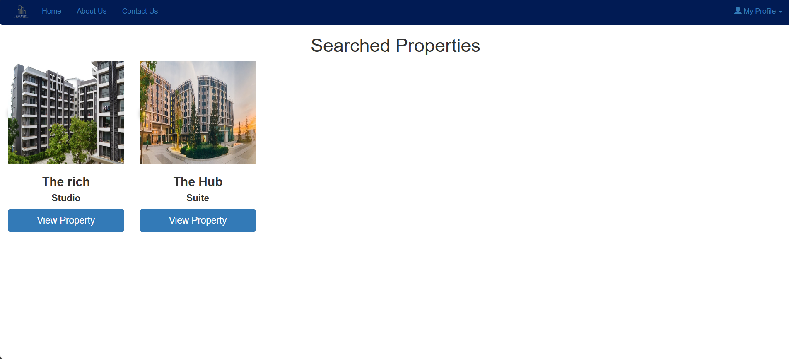
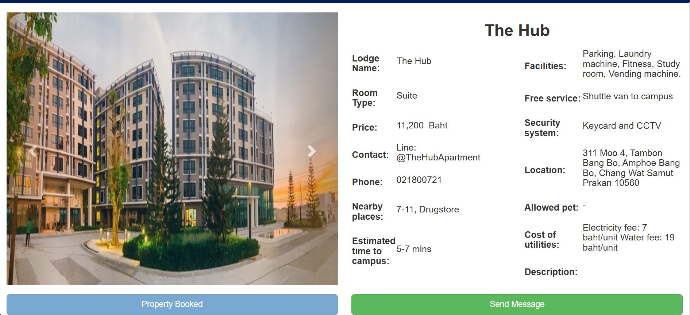
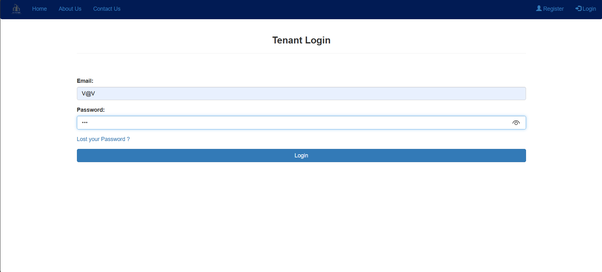
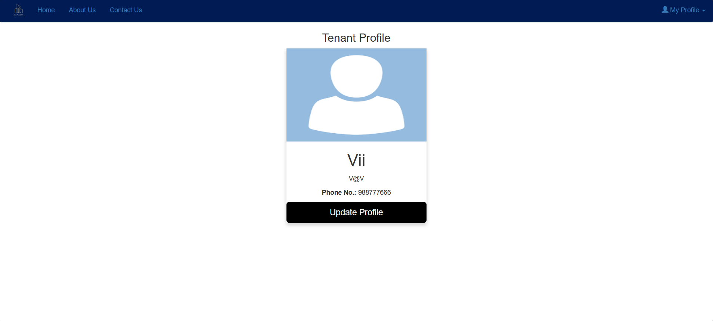

# AU Lodge – Dormitory / Rental Searching Website

AU Lodge is a web application for Assumption University students/staff to search nearby dorms/apartments/condos.  
It supports browsing listings, keyword search, property details, and tenant/owner/admin account flows.

## Screenshots







## Key Features
- Browse rental listings with property cards and detail pages
- Keyword search + results page
- Tenant login/register + profile management
- Owner/Admin modules (manage listing / user flows) *(based on project folders)*
- Reviews/ratings and basic user feedback *(if enabled in your build)*
- Map/route module for location and route viewing *(Google Maps / map module)*

## Information Shown for Each Property
- Rent price + utilities cost
- Room type + room photos
- Facilities (e.g., fitness, pool, laundry, shuttle)
- Location + nearby places + estimated travel time
- Security system + contact information

## Tech Stack
- Frontend: HTML, CSS, JavaScript
- Backend: PHP (Apache)
- Database: MySQL

## Repository Structure
- `renthouse/` – main PHP application
  - `config/` – DB configuration
  - `admin/` – admin pages
  - `owner/` – owner pages
  - `map/` – map related scripts/pages
  - `images/` – UI images/assets
> Large photo folders (e.g., owner-photo/tenant-photo) may be excluded to keep the repo lightweight.

## Local Setup (XAMPP)
1. Install **XAMPP** and start **Apache** + **MySQL**
2. Place this repo (or the `renthouse/` folder) under:
   - `C:\xampp\htdocs\`
3. Create/restore a database named `renthouse`
4. Check DB config:
   - `renthouse/config/config.php`
```php
$db = new mysqli('localhost', 'root', '', 'renthouse');

5. recommend nearby lodges-number of views
6. chat for contacting admins

along with comparative information between other lodge in order to provide users with the best place and the most suitable lifestyle. Most importantly, users can also find a lodge more conveniently, whether it is a promotion that will save several times the budget. As well as supporting the needs of people who want to find a lodge both daily and monthly as well. If users have questions, they can directly contact the admin via chat.
